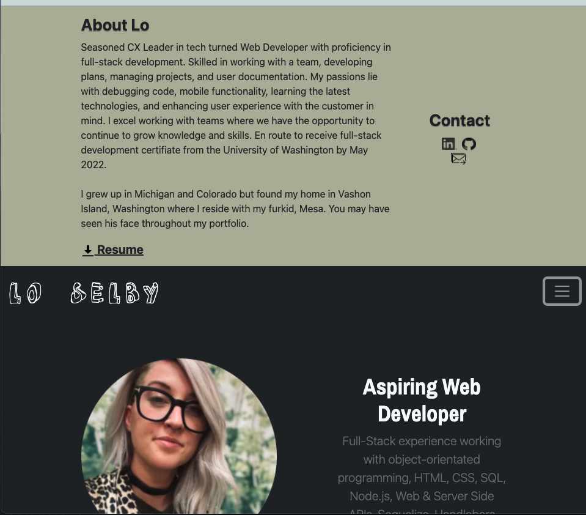
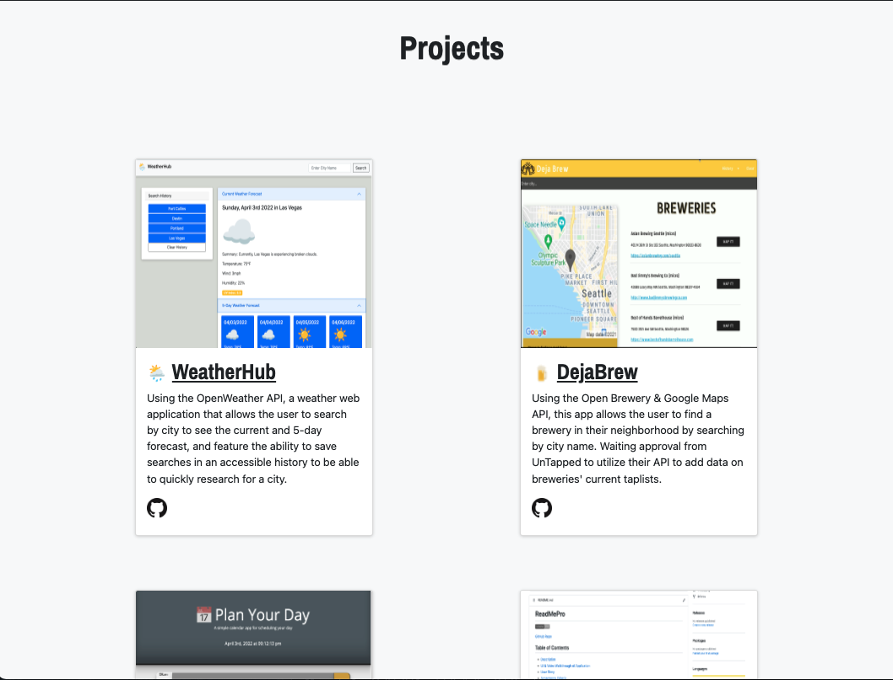
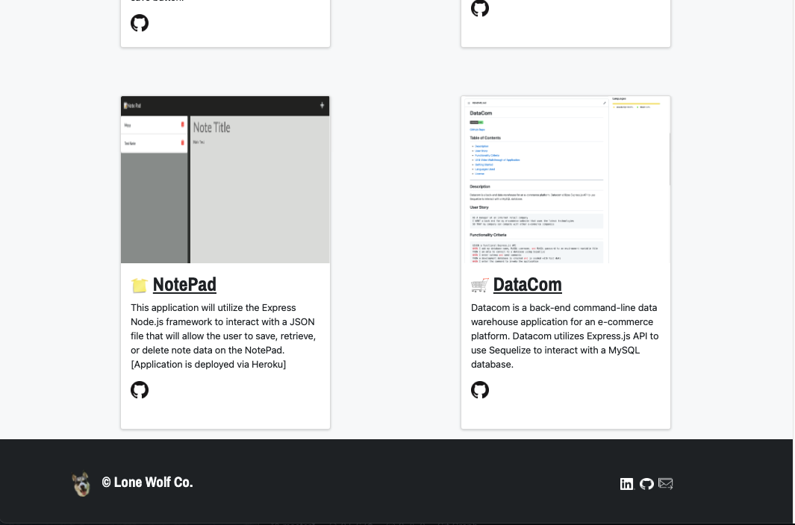

# Lo Selby | Web Engineer | Portfolio

Live Page: https://lonewolfco.github.io/lonewolf

## About Lo
Seasoned CX Leader in tech turned Engineer with proficiency in full-stack development. Skilled in working with a team, developing plans, managing projects, and user documentation. My passions lie with debugging code, mobile functionality, learning the latest technologies, and enhancing user experience with the customer in mind.

Lo's portfolio is designed with minimilistic design in mind with touches of color that compliment the header image to tie it in, in a thoughtful approach. 

## Included in Portfolio

* At least 6 Projects with Video Examples

* Links to GitHub Profile, Repos, LinkedIn, and to email Lo directly

* Link to Download Resume or open in new tab

* About Lo Page with links including various methods of contacting

## Languages Used
- HTML
- CSS / Bootstrap Framework
- Javascript
- React.js
- Node

## Mockup

## License
MIT License

Copyright (c) 2022 Lo Selby [Lone Wolf Co]

Permission is hereby granted, free of charge, to any person obtaining a copy
of this software and associated documentation files (the "Software"), to deal
in the Software without restriction, including without limitation the rights
to use, copy, modify, merge, publish, distribute, sublicense, and/or sell
copies of the Software, and to permit persons to whom the Software is
furnished to do so, subject to the following conditions:

The above copyright notice and this permission notice shall be included in all
copies or substantial portions of the Software.

THE SOFTWARE IS PROVIDED "AS IS", WITHOUT WARRANTY OF ANY KIND, EXPRESS OR
IMPLIED, INCLUDING BUT NOT LIMITED TO THE WARRANTIES OF MERCHANTABILITY,
FITNESS FOR A PARTICULAR PURPOSE AND NONINFRINGEMENT. IN NO EVENT SHALL THE
AUTHORS OR COPYRIGHT HOLDERS BE LIABLE FOR ANY CLAIM, DAMAGES OR OTHER
LIABILITY, WHETHER IN AN ACTION OF CONTRACT, TORT OR OTHERWISE, ARISING FROM,
OUT OF OR IN CONNECTION WITH THE SOFTWARE OR THE USE OR OTHER DEALINGS IN THE
SOFTWARE.
